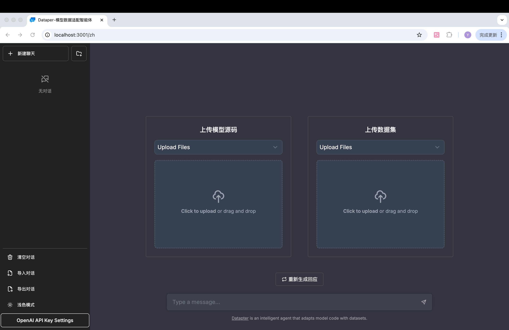
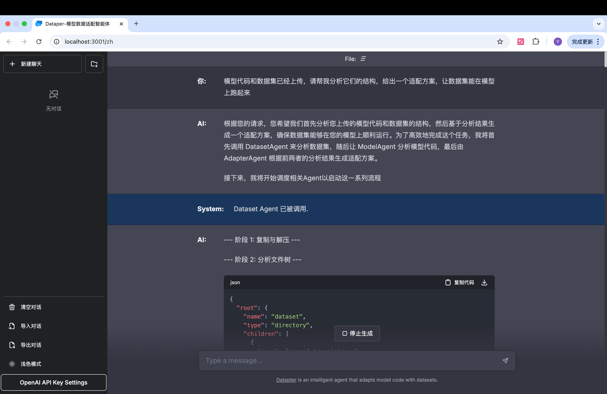

# 📦 datapter

## 🔍 项目简介

`datapter` 是一个基于多 Agent 协作机制的智能代码适配工具，旨在解决不同模型（模型 A → 模型 B）之间 **数据集结构不兼容** 的问题。项目通过调用大模型（如 LLM）理解源数据格式并自动生成目标模型可用的适配代码，使 AI 工程师和研究者免于繁琐的手动编写转换脚本。

该系统广泛适用于 AI 模型迁移、开源模型重用、数据格式转换等场景。

---

## 🧠 核心功能

* 🧩 数据结构理解与抽象（支持 LLM 自动推理）
* 🔁 源格式 → 中间表示 → 目标格式 的自动映射转换
* 🧱 模块化适配器生成（支持分阶段调用）
* 📊 多模态数据集分析（支持图像、文本、表格等）
* 📝 模型代码结构智能分析
* 🔍 智能文件树分析与元数据提取
* 🎯 自动代码生成与适配
* ✅ 自动测试与验证机制

---

## 🏗️ 项目结构

项目位于 `src/` 目录下，遵循清晰的 DDD（领域驱动设计）和多智能体模式：

```
datapter/
├── adapter/                  # 对接层（接口适配、日志）
│   └── vo/                   # 输入输出数据对象
├── app/                      # 服务层（Agent 编排）
├── domain/                   # 领域层
│   ├── agent/               # 智能体实现
│   │   ├── coordinator_agent.py    # 协调调度智能体
│   │   ├── model_agent.py          # 代码分析智能体
│   │   ├── dataset_agent.py        # 数据集分析智能体
│   │   └── adapter_agent.py        # 适配器生成智能体
│   ├── constant/            # 常量定义
│   └── model/               # 领域模型
├── llm/                     # LLM 集成层
│   ├── factory/            # LLM 工厂实现
│   └── model/              # LLM 模型定义
├── tools/                   # 工具类
│   ├── ArchiveDecompressionTool.py  # 压缩文件处理
│   ├── FileTreeAnalysisTool.py      # 文件树分析
│   ├── MetaFileReadTool.py          # 元数据读取
│   └── ...                 # 其他工具
├── utils/                   # 通用工具类
│   ├── embedding_util.py    # 向量嵌入工具
│   ├── msg_utils.py         # 消息处理工具
│   └── SnowFlake.py         # ID 生成器
├── main.py                  # 项目入口
├── requirements.txt
└── README.md
```

---

## 🚀 快速开始

### 0. 克隆项目

克隆时请将子模块一并拉取
```bash
git clone --recursive https://github.com/woyaottk/datapter.git
```
如果已经 clone 过，请更新子模块
```bash
git submodule update --init
```

### 1. 安装依赖

#### 1.1 安装前端依赖
```bash
cd datapter-frontend
npm install
cd ..
```

#### 1.2 安装后端依赖
```bash
# 推荐使用虚拟环境()
pip install -r requirements.txt
```

或使用 `conda`：

```bash
conda env create -f environment.yml
conda activate datapter
```

### 2. 修改配置
#### 2.1 前端配置
前端配置文件位于`datapter-frontend/.env`，可配置请求的后端地址
```env
NEXT_PUBLIC_API_BASE_URL=http://127.0.0.1:8080
```
#### 2.2 后端配置
后端配置文件需将 `.env.example` 复制一份为`.env`

可配置：前端地址，API key，代码及数据集输入保存地址，分析结果输出地址等

必须确保以下配置正确提供：
```env
FRONTEND_URL="http://localhost:3000"
MODELSCOPE.API_KEY=YOUR_API_KEY
DEEPSEEK.API_KEY=YOUR_API_KEY
MISTRAL_API_KEY=YOUR_API_KEY
```

### 3. 启动运行
#### 3.1 启动前端服务
```bash
cd datapter-frontend
npm run dev
```
启动后控制台会输出前端服务地址

#### 3.2 启动后端服务
```bash
python main.py
```

### 4. demo演示
在浏览器中访问 **前端服务地址** 即可访问项目。
效果如下：


文件上传方式有三种：
- 上传文件
- 上传文件夹
- 上传zip压缩包

上传后可以输入prompt，如：
`模型代码和数据集已经上传，请帮我分析它们的结构，给出一个适配方案，让数据集能在模型上跑起来`

效果如下：

---

## 🧬 智能体模块说明

| 智能体文件                  | 功能描述        |
|------------------------|-------------|
| `coordinator_agent.py` | 协调调度智能体     |
| `dataset_agent.py`     | 数据集分析与处理智能体 |
| `model_agent.py`       | 代码分析与理解智能体  |
| `adapter_agent.py`     | 数据代码适配智能体   |

### 数据集分析智能体工作流程
1. 制作副本并递归解压所有压缩包
2. 分析文件树结构并保存
3. 分析元数据补充文件树
4. 输入到大模型中增强文件树
5. 保存结果

### 支持的文件类型
- 图像：`.jpg`, `.jpeg`, `.png`, `.bmp`, `.gif`
- 文本：`.csv`, `.json`, `.jsonl`, `.txt`
- 表格：`.parquet`

---

## 🛠️ 技术栈

* Python 3.12+
* langgraph
* FastAPI
* OpenAI / 通义千问 / DeepSeek API
* Snowflake ID 生成器

---

## 🔮 未来规划

* Web UI 界面可视化转换过程
* 支持更多数据结构类型（表格、图结构、图像标注等）
* 支持社区开源数据集搜索和自动下载
* 任务链路图 + 数据血缘跟踪能力
* 可插拔式插件系统（支持社区模型格式）

---

## 📄 License

本项目采用 MIT 协议开源。
